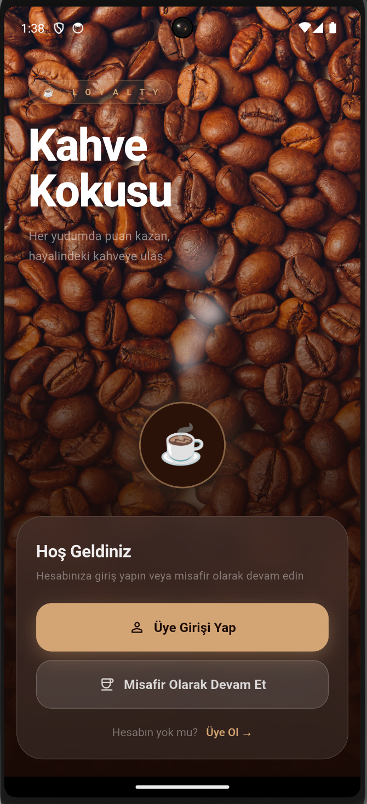
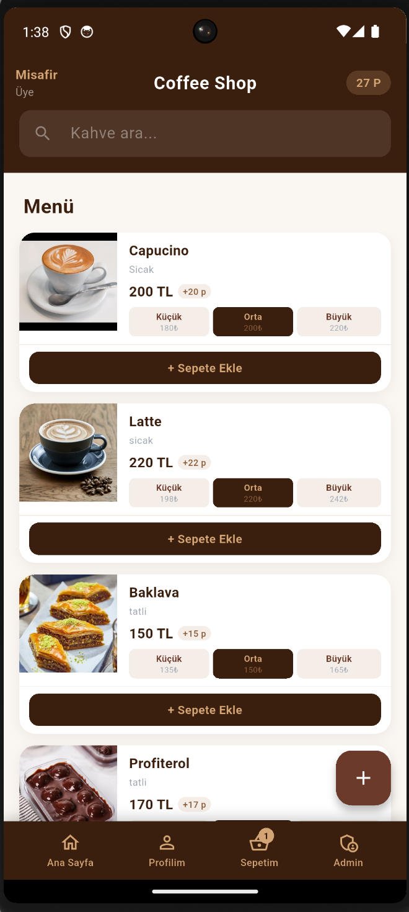
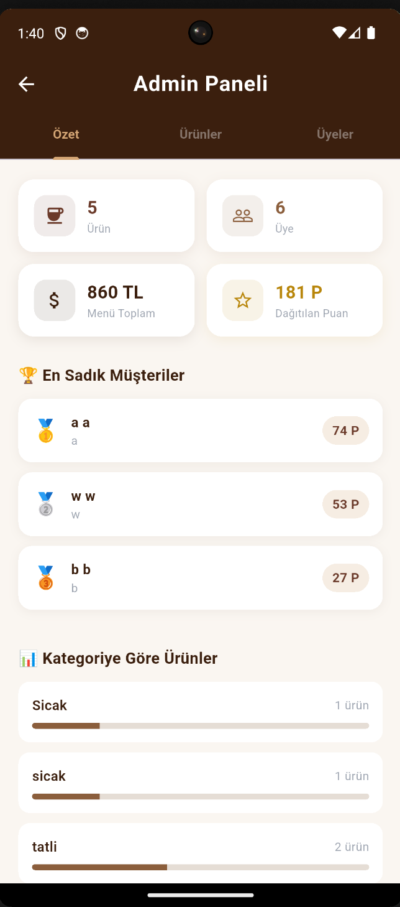
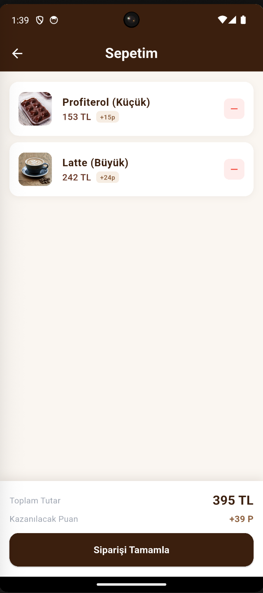
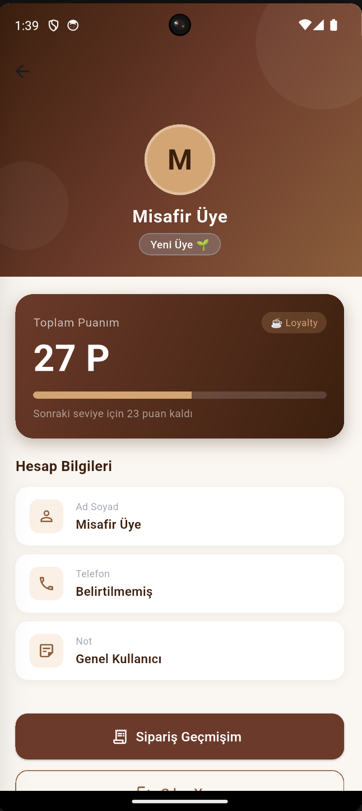

# Coffee Shop Loyalty ☕

A modern and efficient loyalty application developed with **Flutter**. This app allows users to track their coffee purchases, earn rewards, and manage their favorite beverages seamlessly.

## 📸 Screenshots

|İntro Screen| Home Screen| Admin Screen|Cart Screen|Profil Screen|
|:---:|:---:|:---:|:---:|:---:|
|  |  |  | | |


## ✨ Features

* **State Management:** Powered by `provider` for a reactive user experience.
* **Local Storage:** Fast data persistence using `hive`.
* **Custom Branding:** Custom app icons generated via `flutter_launcher_icons`.
* **Clean UI:** Material Design implementation for a smooth look and feel.

## 🛠️ Tech Stack

* **Framework:** Flutter (SDK: >=3.0.0 <4.0.0)
* **Language:** Dart
* **Database:** Hive
* **State Management:** Provider

## 🚀 Getting Started

1.  **Clone the repository:**
    ```bash
    git clone [https://github.com/ibrahimyasar68/coffee_shop_loyalty.git](https://github.com/ibrahimyasar68/coffee_shop_loyalty.git)
    ```

2.  **Install dependencies:**
    ```bash
    flutter pub get
    ```

3.  **Generate Hive adapters:**
    ```bash
    flutter pub run build_runner build
    ```

4.  **Run the app:**
    ```bash
    flutter run
    ```

## 📂 Project Structure

* `lib/`: Main application logic (Providers, Models, UI).
* `assets/images/`: Images and icons used in the app.
* `assets/icon/`: App launcher icon source.

Geliştirici: İbrahim Yaşar

Lisans: MIT
